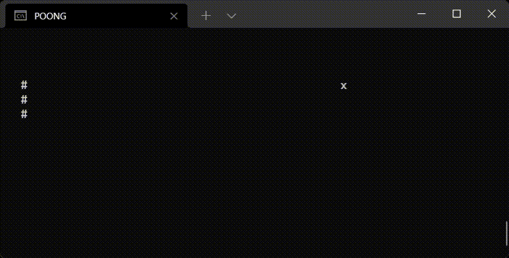

<h1 align="center">
  Hello there!
</h1>

  I am Aven, a game developer that spends most of my time inside Unity making games.     
  When I'm not making games I am most likely working on a side project you may or may  
  not be able to find here. When I do finish a side project I'll try to leave the repository   
  public and open-source it for others. That being said I haven't had many projects leave  
  the WIP state.

 
<h2 align="center">
  "Finished" Projects
</h2>

<table align="center">
	<tr>
		<th><a href="https://github.com/TheAvonian/ShopifyLinkChecker">Shopify Link Checker</a></th>
		<th><a href="https://github.com/TheAvonian/PongAdvanced">Poong</a></th>
	</tr>
	<tr>
		<td align="center">-09/19/21-</td>
		<td align="center">07/28/21 - 08/18/21</td>
	</tr>
	<tr>
		<td align="center"></td>
		<td align="center"> 
	</tr>
	<tr>
		<td align="center" valign="top" width="540">
	This was probably one of the more fun times I've had programming in recent years. The 
	code itself is by no means hard to create nor is there a complex algorithm or anything 
	of the sorts. I whooped it up in about 20-30 minutes, I had a big deadline on making an
	application that can read faulty Shopify websites. People might misinterpret this as making 
	a bot to buy something when it drops but that is by no means what it is nor what it is 
	intended for. I still don't consider this one fully finished as there are a lot of user 
	enhancements to be made and not a lot of documentation explaining the proper ways to use it. 
		</td>
		<td align="center" valign="top" width="540">
	Poong was interesting to me more as a joke, I learned a lot more about what you can do with
	the C# command line from this project however. It is definitely by no means finished, the ball
	can bounce, you can move your paddle, but there isn't a game loop implemented nor an enemy paddle.
	The tick system was very fun to implement and I thoroughly enjoyed this tiny Summer project.
	</tr>
</table>

  
  

